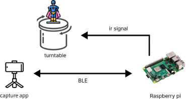

# Introduction
This project is installed and executed in Raspberry Pi. It coordinate with capture app and turntable to carry out capture process (see the diagram below). There are 2 kinds of capture process -- **fixed-angle** and **fixed-time-interval**.  

# How to use
1. Clone the project into Raspberry Pi and enter the project directory
<br/><br/>
2. Make sure the ir signal is sendable. You can check it by running the command below.
```
irsend LIST pisel ""
```
If the signal is avalible, you will see:
```
0000000000ff629d KEY_1
0000000000ff6897 KEY_RESTART
0000000000ff9867 KEY_STOP
```
If not, try **step 5** of this tutorial with "pisel.lircd.conf" in the current directory. 
<br/><br/>
3. Run the command below, and you can find Raspberry Pi with your capture app. (Make sure the bluetooth is opened on your phone.)
```
python3 control.py
```
<br/><br/>
4. If the connection has disconnected for 10 seconds, the parameters of capture process stored in Raspberry Pi would be reset.
